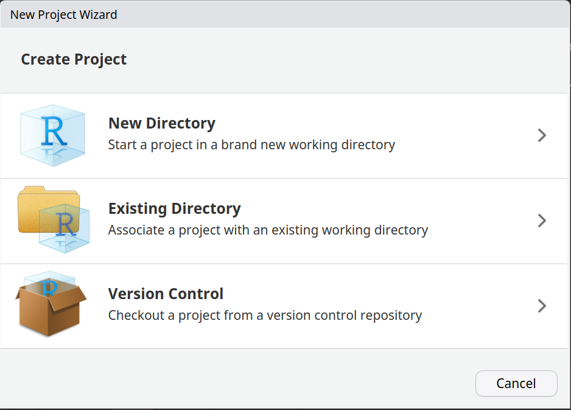
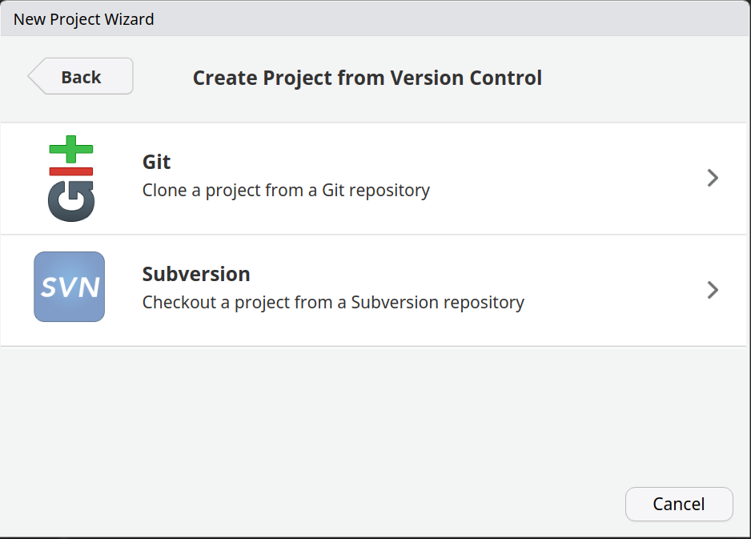
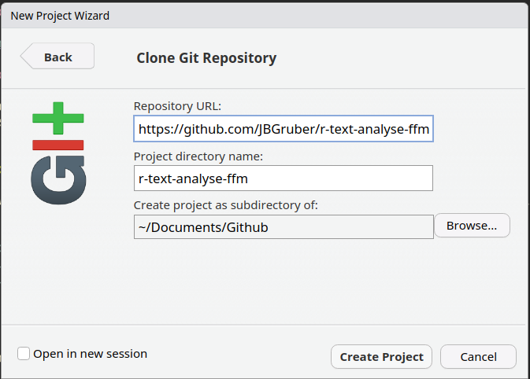

Textanalyse in R: eine Einführung
================

Course Dates: 27.-28. März 2023

Kursleiter: [Johannes B. Gruber](https://www.johannesbgruber.eu/)

# Introduction

The availability of text data has exploded in the last two decades.
First the availability of text through digital archives, then the advent
of digital media communication like online news and press releases and
most recently public communication of non-elite actors on social media.
For political science this opens up exciting new possibilities for
research as many processes which occurred in private or elite venues is
now accessible. At the same time, the sheer amount of data makes
manually analysing meaningul fractions of it impossible.

This course is an introduction to the available methods and software for
automated content analysis. The 101 in it’s name is meant to indicate
that this is a introductory course. However, the introductory part is
into automated content analysis while the expectation is that you are
comfortable with R, the programming language used in this course.

What should be clear about the course from the beginning though is that
despite recent advances, “All Quantitative Models of Language Are
Wrong—But Some Are Useful” (Grimmer and Stewart 2013, 3). The primary
goal of this course is thus to understand the types of questions we can
ask with text, and how to go about answering them.

In this two-day course, we are going to look at the different topics
mostly from a practical standpoint with a little theoretical and
statistical background where necessary. The schedule looks as follows:

<table class="gt_table">
  
  <thead class="gt_col_headings">
    <tr>
      <th class="gt_col_heading gt_columns_bottom_border gt_right" rowspan="1" colspan="1" scope="col">time</th>
      <th class="gt_col_heading gt_columns_bottom_border gt_left" rowspan="1" colspan="1" scope="col">Day 1</th>
      <th class="gt_col_heading gt_columns_bottom_border gt_left" rowspan="1" colspan="1" scope="col">Day 2</th>
    </tr>
  </thead>
  <tbody class="gt_table_body">
    <tr><td class="gt_row gt_right"><div class='gt_from_md'><p>09:00-10:30</p>
</div></td>
<td class="gt_row gt_left"><div class='gt_from_md'><p><a href="https://github.com/JBGruber/r-text-analyse-ffm/blob/main/1_Theory.qmd">Overview, Background and some Theory</a></p>
</div></td>
<td class="gt_row gt_left"><div class='gt_from_md'><p><a href="https://github.com/JBGruber/r-text-analyse-ffm/blob/main/5_Correlation_and_regression.qmd">Text Correlations and Regression Models</a></p>
</div></td></tr>
    <tr><td class="gt_row gt_right"><div class='gt_from_md'><p>11:00:12:30</p>
</div></td>
<td class="gt_row gt_left"><div class='gt_from_md'><p><a href="https://github.com/JBGruber/r-text-analyse-ffm/blob/main/2_R_basics.qmd">R Basics Repetition</a></p>
</div></td>
<td class="gt_row gt_left"><div class='gt_from_md'><p><a href="https://github.com/JBGruber/r-text-analyse-ffm/blob/main/6_supervised-learning.qmd">Supervised Classification Methods</a></p>
</div></td></tr>
    <tr><td class="gt_row gt_right"><div class='gt_from_md'><p>14:00-15:30</p>
</div></td>
<td class="gt_row gt_left"><div class='gt_from_md'><p><a href="https://github.com/JBGruber/r-text-analyse-ffm/blob/main/3_Obtaining_Text_Data.qmd">Obtaining Text Data</a></p>
</div></td>
<td class="gt_row gt_left"><div class='gt_from_md'><p><a href="https://github.com/JBGruber/r-text-analyse-ffm/blob/main/7_unsupervised-learning.qmd">Unsupervised Classification Methods</a></p>
</div></td></tr>
    <tr><td class="gt_row gt_right"><div class='gt_from_md'><p>16:00-17:30</p>
</div></td>
<td class="gt_row gt_left"><div class='gt_from_md'><p><a href="https://github.com/JBGruber/r-text-analyse-ffm/blob/main/4_dictionary-analysis.qmd">Dictionary methods</a></p>
</div></td>
<td class="gt_row gt_left"><div class='gt_from_md'><p><a href="https://github.com/JBGruber/r-text-analyse-ffm/blob/main/8_Word_Embeddings_and_Deep_Learning.qmd">Word Embeddings and Deep Learning</a></p>
</div></td></tr>
  </tbody>

  
</table>
</div>

# Preparation before the course
## Download the project

In RStudio go to "Create a project" (top left corner with this symbol ).
Then select "Version Control":



In the next window, select "Git":



Then copy the URL `https://github.com/JBGruber/r-text-analyse-ffm.git` into the URL field and select where to download the project to.



After clicking "Create Project", a new session should open.
That's it!

## Install dependencies

The short code below will check the tutorial files for mentioned R packages and install the missing ones on your computer:

```r
if (!requireNamespace("rlang", quietly = TRUE)) install.packages("rlang", dependencies = TRUE)
rlang::check_installed("attachment")
rlang::check_installed(attachment::att_from_rmds(list.files(pattern = ".qmd")))
```

## Update packages

You should update the R packages installed on your computer:

```r
update.packages(ask = FALSE, Ncpus = 4L)
```

This uses 4 cores, you could also use more/less depending on your system.

